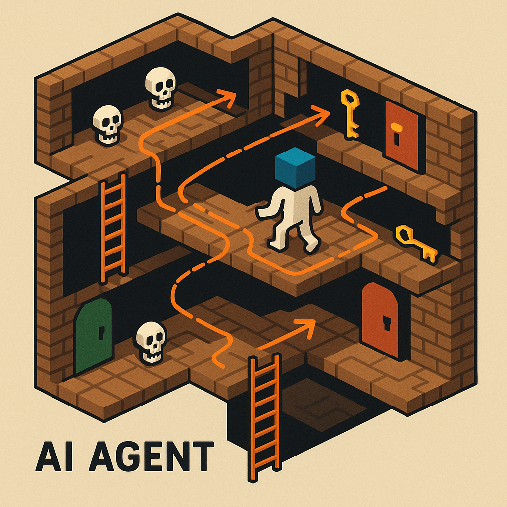

<div align="center">
  <h1 style="font-family: Arial;">Maze Net</h1>
  <h3>Một AI agent được huấn luyện bằng Deep Reinforcement Learning để chinh phục tựa game cổ điển Montezuma’s Revenge.</h3>
</div>

<p align="center">
  
</p>

## 1. Mục tiêu

- **Môi trường**: Thiết lập Gym-wrapper cho Atari, thu thập frame, reward, action.
- **Huấn luyện**: Xây dựng pipeline Deep RL (PPO/DQN/IMPALA…), theo dõi loss, episodic return, entropy.
- **Đánh giá**: Đo lường hiệu suất trên các episode, so sánh checkpoint, visualize trajectory.

## 2. Cấu trúc thư mục (hiện tại)

```
assets/     # Hình ảnh minh họa, diagrams, sample video GIF
src/        # Code môi trường (env wrappers) & agent (network, replay buffer)
scripts/    # Các công cụ phụ trợ 
requirements.txt
```

## 4. Quy tắc đóng góp

1. **Nhánh**: tạo branch `feature/<tên>` hoặc `bugfix/<tên>`.
2. **Commit**: theo [Conventional Commits](https://www.conventionalcommits.org/) – ví dụ `fix(model): sửa lỗi gradient clipping`.
3. **Pull Request**: tiêu đề ngắn gọn, mô tả chi tiết rõ ràng.

> Cập nhật README khi thêm module mới hoặc thay đổi cấu trúc thư mục.

